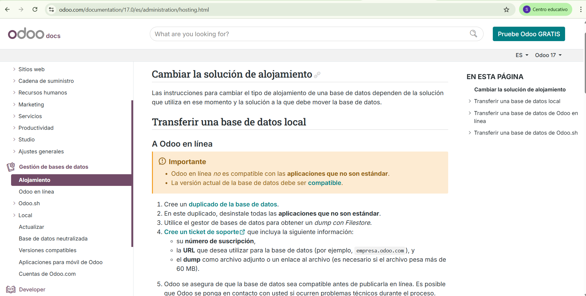
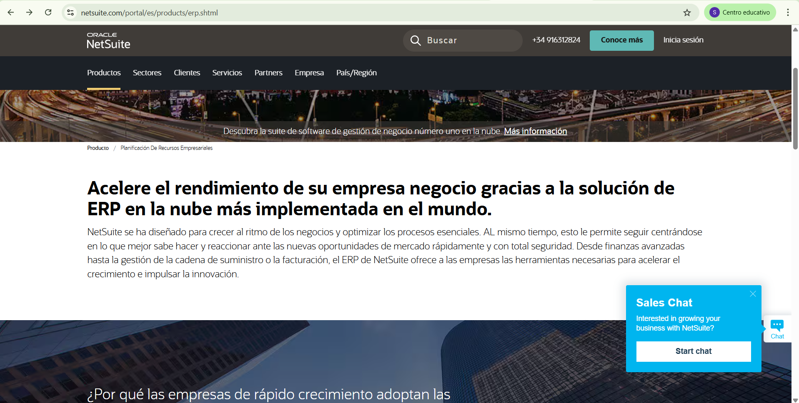
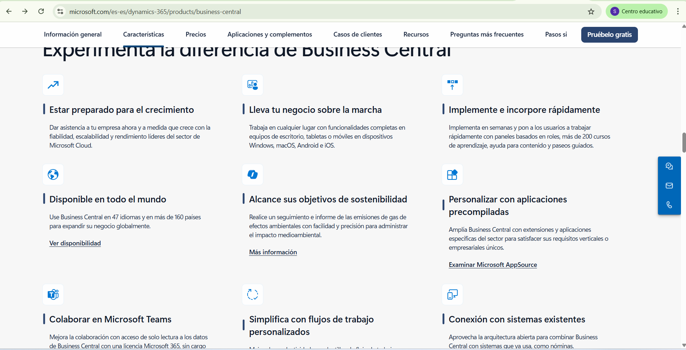

# Comparativa de ERP actuales

## Índice

1. Análisis de los ERPs elegidos
2. Casos en los que elegirías esos ERPs
3. Tabla comparativa de ERPs
4. Conclusiones para el caso concreto (Elección de ERP y por qué)
5. Fuentes y evidencias

### **1. Análisis de los ERPs elegidos**

#### **1.1 Odoo**

#### **¿Qué es?**

Odoo es una suite de aplicaciones empresariales integradas de código abierto que permite gestionar de forma centralizada todos los procesos clave de una empresa. Está diseñada para ser modular y escalable, permitiendo a las pymes y grandes empresas adaptar el sistema a sus necesidades específicas.

Incluye módulos para:

* Contabilidad y facturación
* Ventas y CRM
* Compras
* Inventario y logística
* Punto de venta (POS)
* Recursos humanos
* Proyectos y servicios
* Marketing
* Sitio web y comercio electrónico
* Gestión documental, firmas y productividad

Además, Odoo ofrece varias opciones de alojamiento (nube, local y Odoo.sh), con amplias posibilidades de personalización. Cuenta con una amplia y activa comunidad de usuarios y desarrolladores que contribuyen continuamente al crecimiento y mejora del sistema.

#### **1.2 NetSuite**

#### **¿Qué es?**

NetSuite ERP es una suite de aplicaciones empresariales en la nube, impulsada por inteligencia artificial, diseñada para automatizar procesos clave y proporcionar visibilidad en tiempo real del rendimiento operativo y financiero.

Incluye módulos integrados para:

* Contabilidad
* Gestión de pedidos
* Inventario
* Producción
* Cadena de suministro
* Operaciones de almacén

Esta solución está especialmente orientada a medianas y grandes empresas, permitiéndoles tener un control más preciso y eficiente de sus operaciones.

#### **1.3 Microsoft Dynamics 365 Business Central**

#### **¿Qué es?**

Microsoft Dynamics 365 Business Central es una solución ERP en la nube dirigida a pequeñas y medianas empresas. Integra múltiples áreas del negocio en una única plataforma, optimizando procesos, mejorando la productividad y facilitando la toma de decisiones informadas.

Ofrece funcionalidades para:

* Finanzas y contabilidad
* Gestión de ventas y clientes
* Servicio al cliente
* Cadena de suministro
* Gestión de proyectos
* Automatización de tareas con inteligencia artificial (Copilot)
* Integración nativa con Microsoft 365 (Outlook, Excel, Teams)

### **2. Casos en los que elegirías esos ERPs**

#### **2.1 Odoo**

Odoo es ideal para pymes y empresas en crecimiento que buscan una solución flexible y personalizable. Su naturaleza de código abierto permite realizar adaptaciones específicas sin depender exclusivamente de un proveedor. Además, si la empresa necesita una gestión integral que abarque desde la tienda online hasta recursos humanos y CRM, Odoo ofrece una plataforma modular que permite incorporar únicamente los módulos necesarios.

Esta solución es especialmente recomendable para:

* Empresas con presupuestos ajustados que desean comenzar con una solución básica y escalarla según sus necesidades.
* Negocios que requieren integración con múltiples aplicaciones o herramientas personalizadas.
* Organizaciones que prefieren tener un control total sobre su infraestructura, con opciones de alojamiento tanto local como en la nube.

#### **2.2 NetSuite**

NetSuite está orientado a medianas y grandes empresas que necesitan una solución robusta, escalable y con soporte global. Su enfoque en la automatización y el uso de inteligencia artificial lo hace adecuado para compañías con procesos complejos y volúmenes altos de operaciones.

Se recomienda para:

* Empresas con múltiples ubicaciones o que operan internacionalmente.
* Negocios que requieren una visión consolidada en tiempo real del rendimiento financiero y operativo.
* Organizaciones que buscan una solución SaaS sin preocuparse por la gestión del hardware o la infraestructura.

#### **2.3 Microsoft Dynamics 365 Business Central**

Microsoft Dynamics 365 Business Central es la mejor opción para pequeñas y medianas empresas que ya utilizan productos Microsoft y desean una integración fluida con herramientas como Office 365 y Teams. Es ideal para empresas que buscan una solución ERP sencilla, con funcionalidades completas para gestionar finanzas, ventas y operaciones en una única plataforma.

Recomendado para:

* Pymes que buscan mejorar la productividad con automatización y funcionalidades integradas de IA (Copilot).
* Organizaciones con usuarios acostumbrados al ecosistema Microsoft.
* Empresas que valoran la facilidad de uso y la integración nativa con herramientas de oficina y colaboración.

### **3. Tabla comparativa de ERPs**

|            **Criterio**            |                                       **Odoo**                                       |                                 **NetSuite**                                 |                **Microsoft Dynamics 365 Business Central**                |
| :-----------------------------------: | :-------------------------------------------------------------------------------------: | :----------------------------------------------------------------------------: | :-------------------------------------------------------------------------: |
|        Modelo de despliegue        |                                 Nube, local y Odoo.sh                                 |                            Solo en la nube (SaaS)                            |                          Nube (Microsoft Azure)                          |
|        **Facilidad de uso**        |       Interfaz intuitiva, requiere algo de configuración; acceso desde móvil       |                 Interfaz moderna; curva media de aprendizaje                 |        Muy usable para usuarios de Microsoft; accesible y familiar        |
| **Personalización e integración** |                       Muy alta: módulos, API, código abierto                       |         Alta: personalización vía partners y herramientas propias         |     Alta integración con productos Microsoft; personalización media     |
|    **Seguridad y cumplimiento**    | Cumple RGPD, configurable según alojamiento; control completo si se aloja localmente |    Seguridad robusta y cumplimiento global, datos en centros certificados    |     Seguridad en Azure, cumplimiento normativo y permisos granulares     |
|       **Cobertura funcional**       |        Muy amplia: finanzas, ventas, compras, RRHH, marketing, web, POS, etc.        |         Muy fuerte en contabilidad, pedidos, almacenes y producción         | Finanzas, ventas, servicio al cliente, cadena de suministro, IA integrada |
|      **Ecosistema y soporte**      |           Comunidad activa, miles de desarrolladores, buena documentación           |                Soporte oficial + red de partners certificados                |         Soporte de Microsoft, formación oficial, red de partners         |
|   **Coste total estimado (TCO)**   |    Bajo-medio: licencia libre + costes de implantación según módulos y soporte    |            Alto: pago por suscripción, implementación y soporte            |    Medio: pago por usuario, integración sencilla si ya usas Microsoft    |
|          **Escalabilidad**          |                     Muy alta: modular, multiusuario, multiempresa                     | Muy alta: pensado para escalar globalmente y gestionar operaciones complejas |   Alta: adaptable al crecimiento de pymes dentro del entorno Microsoft   |

### **4. Conclusiones para el caso concreto**

Tras analizar las tres soluciones ERP y estudiar el caso de GreenGym Solutions, se concluye que Odoo es la opción más adecuada para su digitalización y crecimiento.

GreenGym es una pyme del sector servicios con una gestión manual, dispersa y propensa a errores. Necesita un sistema unificado que permita:

* Gestionar clientes y socios de forma organizada, con historial de pagos y asistencias
* Automatizar reservas y cuotas
* Conectar ventas en tienda con stock e inventario en tiempo real
* Tener trazabilidad entre servicios vendidos, facturas y cobros
* Mejorar la comunicación entre áreas como recepción, entrenadores y administración

Odoo responde perfectamente a estas necesidades por su enfoque modular, su cobertura funcional (ventas, CRM, inventario, facturación, compras, POS, RRHH e incluso sitio web), y su versión gratuita (Community) que puede instalarse en local. Esto permite a GreenGym mantener el control total sobre su infraestructura, sin costes de licencia por usuario ni dependencia de terceros.

Además, Odoo ofrece mayor autonomía tecnológica. La empresa puede configurar, extender o adaptar el sistema con ayuda de desarrolladores propios o con apoyo de su amplia comunidad activa. Esto facilita la evolución del ERP al ritmo del negocio, sin quedar atado a un único proveedor.

Frente a esto, NetSuite está pensado principalmente para empresas medianas o grandes, con presencia internacional, estructuras más complejas y mayor presupuesto. Aunque ofrece una solución muy potente, su enfoque completamente en la nube, su modelo cerrado y sus altos costes lo hacen menos adecuado para una pyme como GreenGym.

Por otro lado, Microsoft Dynamics 365 Business Central es una alternativa sólida, especialmente si ya se trabaja con el ecosistema Microsoft (Excel, Teams, Outlook), pero su modelo de suscripción por usuario y menor capacidad de personalización pueden suponer limitaciones en el medio plazo, además de implicar una mayor dependencia de terceros y menos control técnico.

Por todo ello, Odoo es la mejor elección para GreenGym, ya que combina funcionalidad, flexibilidad, control y un coste asumible, facilitando su transformación digital de forma progresiva, eficaz y adaptada a sus necesidades reales.

### 5. Fuentes y evidencias

A continuación se mostrarán imágenes de las páginas web oficiales donde se ha buscado y extraído la información para el análisis de los ERP presentados.

https://www.odoo.com/documentation/17.0/es/administration/hosting.html

https://www.netsuite.com/portal/es/products/erp.shtml

https://www.microsoft.com/es-es/dynamics-365/products/business-central

